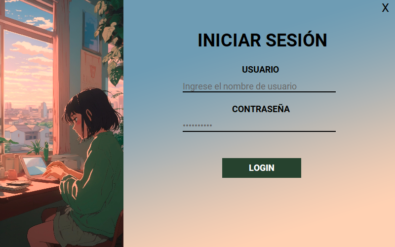
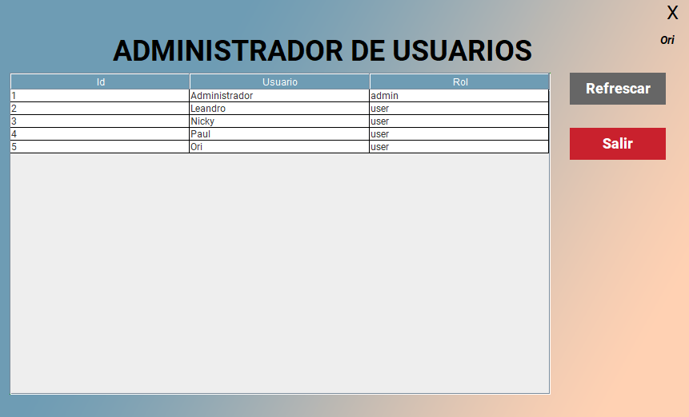
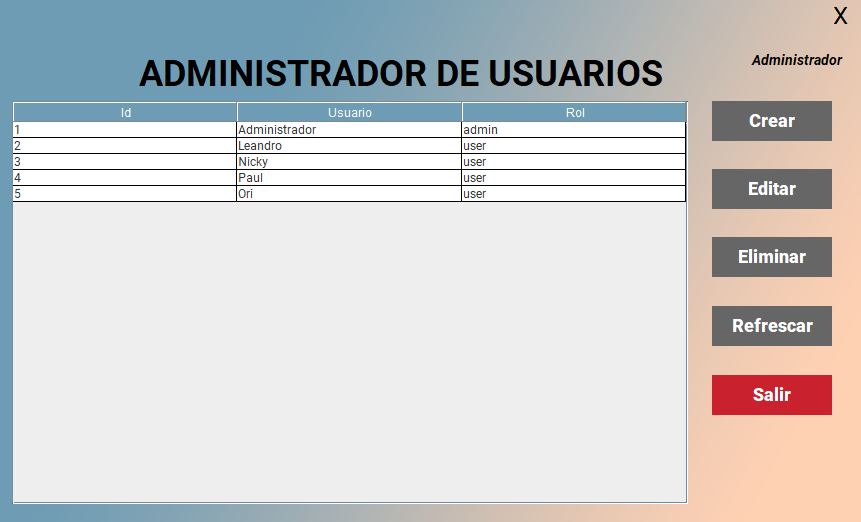
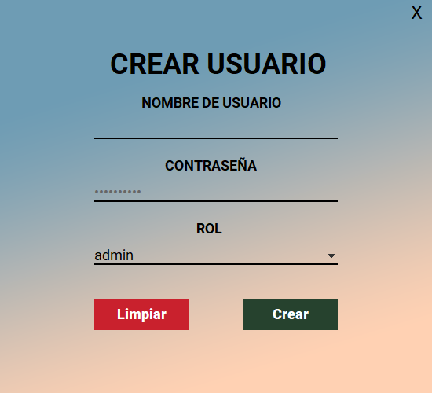
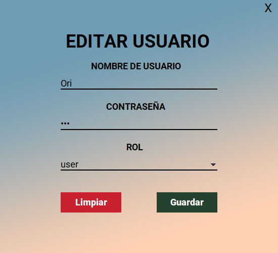
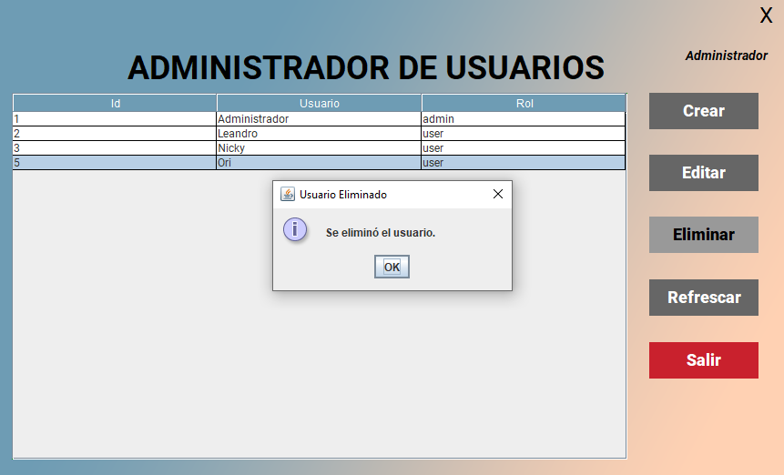

# Login con Roles y Permisos 
- Cada usuario tiene asignado un rol que le permite realizar acciones de administrador o de usuario común.
- Aplicación de escritorio con funcionalidad CRUD (Crear, Leer, Actualizar, Eliminar).
- Diseñada para gestionar los diferentes usuarios registrados.
- Interfaz intuitiva para ingresar, visualizar, actualizar y eliminar registros de cada uno de los usuarios.
- Permite manejar información detallada de los usuarios.
- Desarrollada con Java y Swing para una experiencia eficiente y fácil de usar.
- Utiliza JPA para la persistencia de datos.

## Capturas

> Login

> Administrador de Usuarios **(ROL USUARIO)**

> Administrador de Usuarios **(ROL ADMIN)**

> Crear Usuario

> Editar Usuario

> Eliminar Usuario
